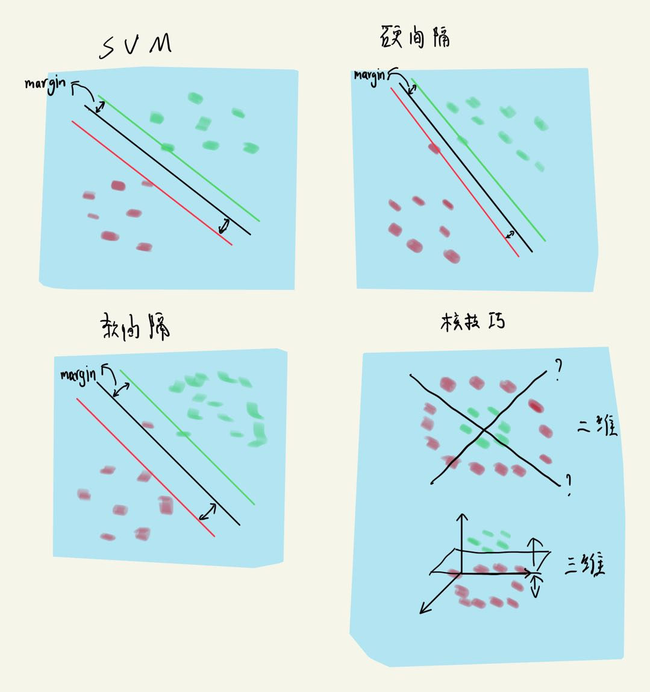

# SVM

支持向量机(分类)

# 简述

通过找到一个线性超平面将数据分开

# 4种情况

- 1、基本SVM(左上)：本身数据可以线性可分。超平面间隔比较合适。
- 2、硬间隔SVM(右上)：当异常值(红色)比较靠近绿色时，会导致超平面间隔缩小，会导致模型泛化能力降低。模型不容许有分类错误点，导致对异常值不敏感，模型泛化能力降低。
- 3、软间隔SVM(左下)：在硬间隔的基础上，模型容许有错误分类发生，模型能够应对一些异常值，超平面间隔也会增大，模型泛化能力提升。
- 4、核技巧(右下)：当模型不管怎样都无法找到一个合适的超平面时，可以试着将数据从二维提升到更高维度，就可以找到一个合适的平面将数据分开。(最长使用rbf核函数（高斯径向基核函数))